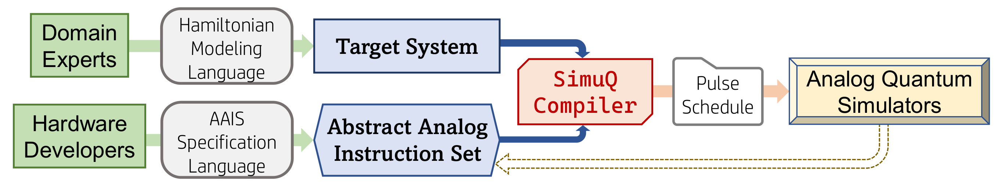
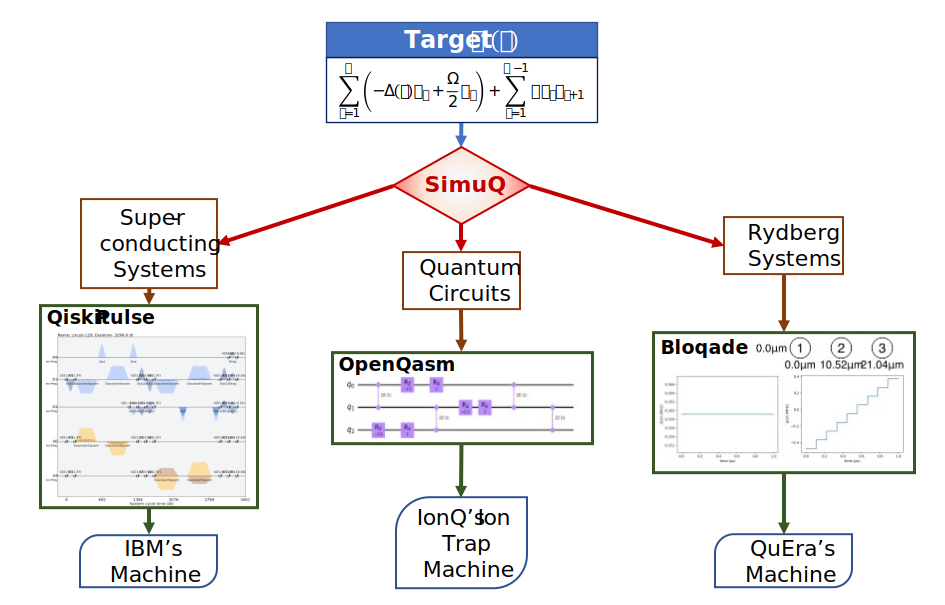

SimuQ is a domain-specific language designed for quantum simulation problem on near-term quantum devices. SimuQ aims to reduce domain barriers in simulating Hamiltonian evolution on real quantum devices for users with minimal physics knowledge. We provide an open-source Python implementation of SimuQ, and a solver-based compilation framework generating pulse-level control code for multiple platforms of quantum devices include IBM's Qiskit Pulse for superconducting transmon qubit devices, QuEra's Bloqade for neutral atom arrays, and quantum circuits for other general machines.

<div class="has-text-centered">
<a href="https://github.com/PicksPeng/SimuQ" class="button is-primary">View on GitHub</a>
<a href="https://github.com/PicksPeng/SimuQ/archive/refs/heads/main.zip" class="button is-primary">Download .zip</a>
<a href="https://https://arxiv.org/abs/2303.02775" class="button is-primary">Check on arXiv</a>
</div>

# SimuQ Framework

The framework of SimuQ contains:
* Target system programmed by front-end users via Hamiltonian Modeling Language.
* Abstract analog instruction set (AAIS) of the programmable analog devices programmed by hardware developers via AAIS Specification Language (supporting multiple platforms).
* SimuQ compiler generates pulse schedules from the programmed target system and AAIS.



# Supported Backends

We currently support the following backends:
* Rydberg atom arrays: Bloqade and QuEra's machines via Amazon Braket.
* Superconducting transmon qubit systems: Qiskit Pulse for IBM machines.
* Quantum circuits: Qiskit and Amazon Braket.

An illustration of SimuQ capability:



# Documentation

For full instructions, please check [Documentation](/QWIRE/docs/).

# Citations

If you are using SimuQ in your work, please cite [our arXiv paper](https://arxiv.org/abs/2303.02775) :
```
@article{peng2023simuq,
  title         = {SimuQ: A Domain-Specific Language for Quantum Simulation with Analog Compilation}
  author        = {Peng, Yuxiang and Young, Jacob and Liu, Pengyu and Wu, Xiaodi},
  journal       = {arXiv preprint arXiv:2303.02775},
  year          = {2023},
  month         = mar,
}
```
